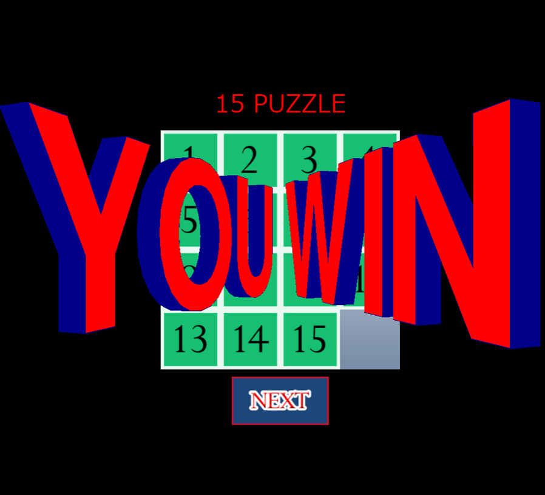
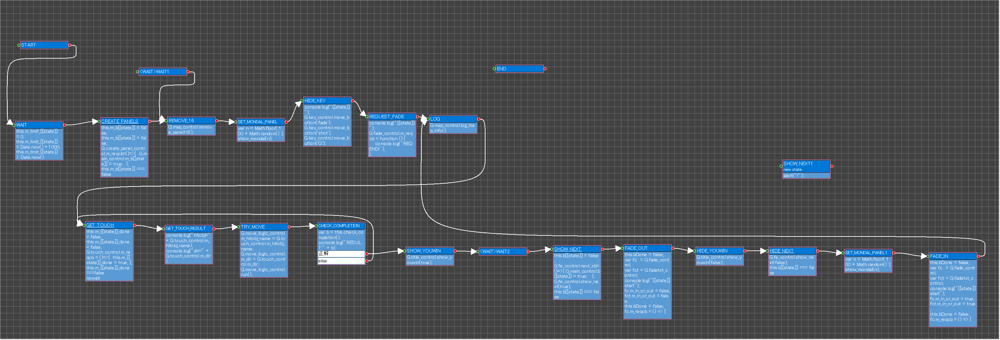
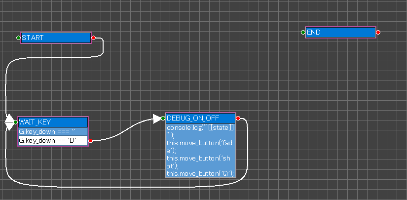
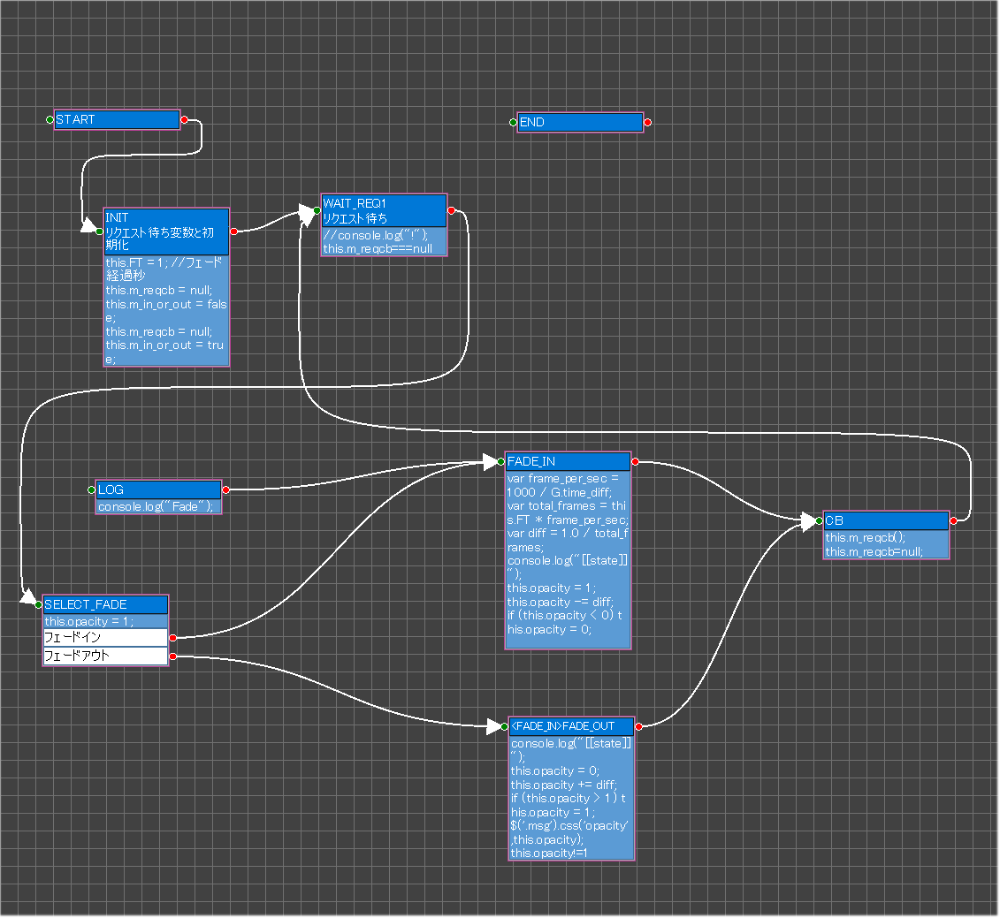
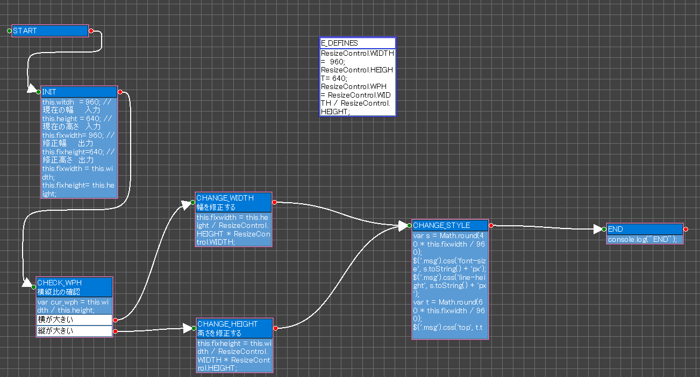
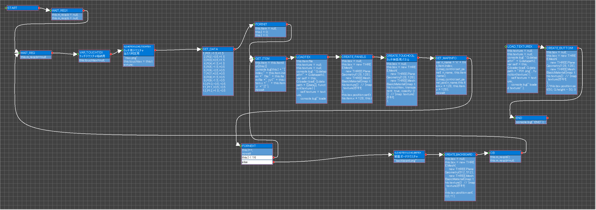
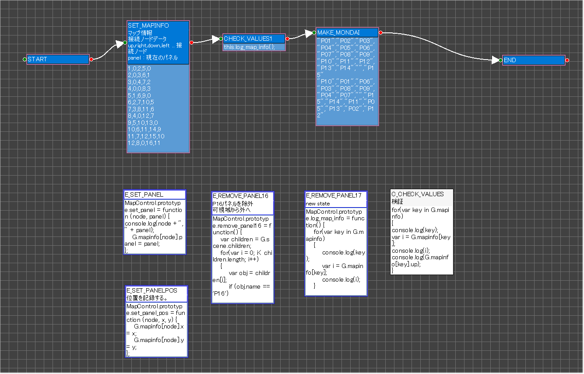
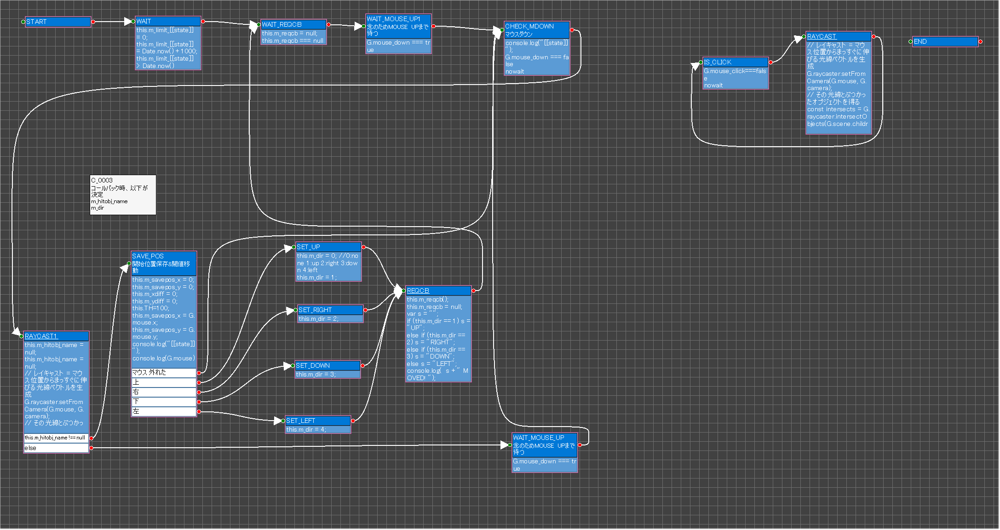
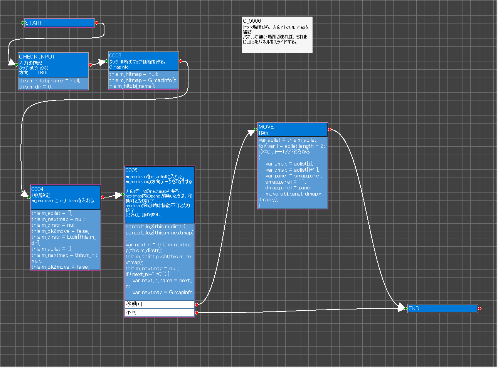
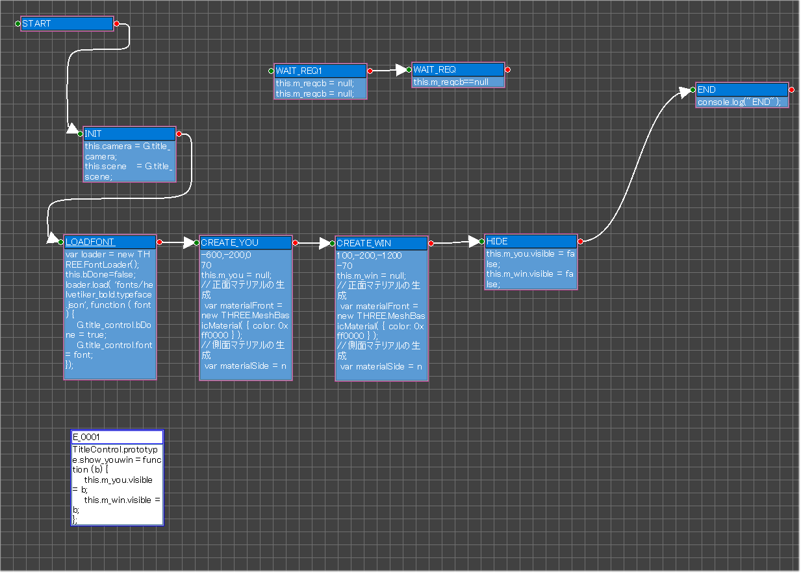

# psgg-javascript-15puzzle
This is a StateGo JavaScript sample.

[play](https://statego.programanic.com/sample/15puzzle/threejs-try.html)

# Libiraries

+ jquery
+ threejs

# StateGo Charts
## MainControl

## FEControl

## KeyControl

## FadeControl

## FadeTextControl

## ResizeControl

## CreatePanelsControl

## MapControl

## TouchControl

## MoveLogicControl

## TitleControl

