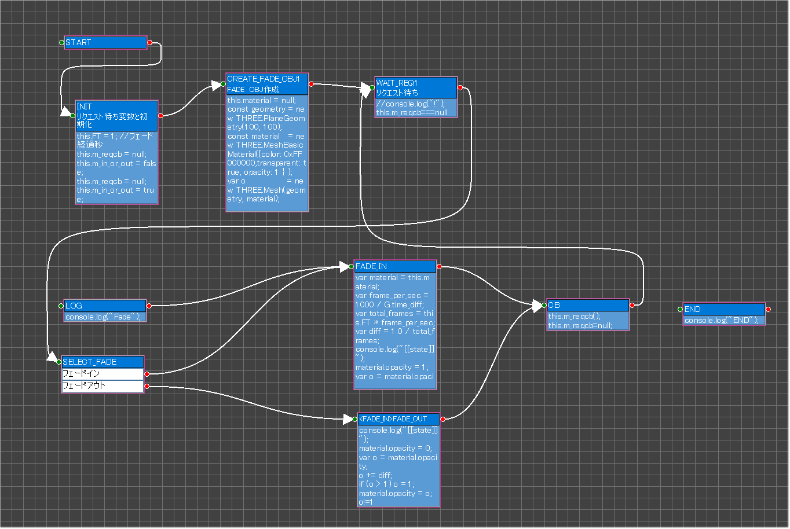

# psgg-javascript-15puzzle
This is a StateGo JavaScript sample.

# MainControl

# FEControl

# KeyControl

# FadeControl

# FadeTextControl

# ResizeControl

# CreatePanelsControl

# MapControl

# TouchControl

# MoveLogicControl

# TitleControl

